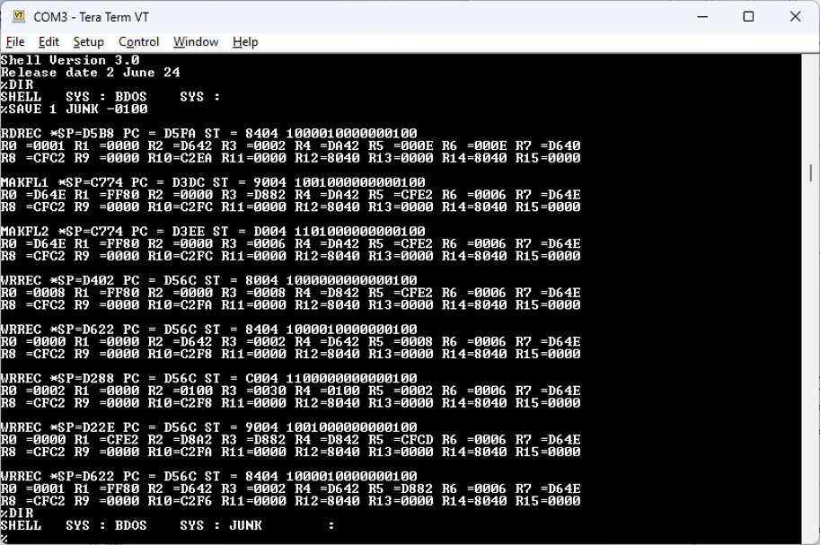

# Using TMS 9000 XOP Instruction to implement a Debugging Function
Adding a software based debugging function to the TMS9900 is straight forward by using the XOP to implement a very simple but effective debugging function.  A screen shot of debugging an operation is shown here.




## Define the XOP Operation 
You first define your XOP instruction using the familiar declaration:

```
DXOP	DEBUG,15
```
Which declares that we are using XOP 15 and DEBUG is its name to declare in the assembler.

A sample test programme that demonstrates how to use it.   The following is a simple set of instructions
with the DEBUG XOP inserted into your code.

```                     ;
                        ;
                        ;---perform simple tests
                        ;
                        ;
  0102   02E0 0142      TEST1:	LWPI	WORKSP
U 0106   0200 0000      	LI	SP,STACKP
  010A   0201 E5E5      	LI	R1,0E5E5H
  010E   2E01           	PUSH	R1
  0110   0200 7FFF      	LI	R0,7FFFH
  0114   0201 0002      	LI	R1,2
  0118   A040           	A	R0,R1
  011A   2FE0 0130      	DEBUG	@ADDTEST
  011E   2DA0 0128      	CALL	@TEST2
  0122   2E43           	POP	R3
  0124   0420 E000      	BLWP	@MONITOR
                        
  0128   0A11           TEST2:	SLA	R1,1
  012A   2FE0 0139      	DEBUG	@SLATEST
  012E   2DC0           	RET
                        ;
                        ; NAMES OF THE ROUTINES BEING DEBUGGED
                        ;
  0130   5445 5354      ADDTEST:	TEXT	"TEST1-ADD"
  0134   312D 4144      
  0138   44             
  0139   5445 5354      SLATEST:	TEXT	"TEST2-SLA"
  013D   322D 534C      
  0141   41             
                        ;
                        ;--BUFFERS ETC
                        ;
  0142                  	EVEN
  0142                  WORKSP	BSS	32
  0162                  STACKL	BSS	32
  0180                  STACKP	EQU	$-2                               
                        ;
  0182                  	END
```

and the code in DEBUG(XOP) will produce, during execution, something such as this:

```
TEST1-AD *SP=E5E5 PC = 011E ST = 8807 1000100000000111
R0 =7FFF R1 =8001 R2 =C404 R3 =A031 R4 =A030 R5 =6118 R6 =610A R7 =820C
R8 =1867 R9 =7033 R10=067F R11=5504 R12=8823 R13=2405 R14=AF65 R15=A432

TEST2-SL *SP=0122 PC = 012C ST = D807 1101100000000111
R0 =7FFF R1 =0002 R2 =C404 R3 =A031 R4 =A030 R5 =6118 R6 =610A R7 =820C
R8 =1867 R9 =7033 R10=067D R11=5504 R12=8823 R13=2405 R14=AF65 R15=A432
```
## Source Code for the Debugger 
The source code for the XOP DEBUG function is:

```
                        ;************************************************
                        ;	DEBUG AND TRACING INFORMATION
                        ;
                        ;	DEBUG @MODULE_NAME
                        ;
                        ;	THE MODULE_ID WILL BE PRINTED SO THAT THE USER CAN TELL WHICH
                        ;	MODULE IS BEING DEBUGGED.  KEEP TO 8 BYTES AND NULL TERMINATED
                        ;
                        ;
                        ;*************************************************
                        ;
  E774   0208 0008      XOP15:	LI	R8,8		;KEEP NAMES TO 8 BYTES
  E778   0209 DED0      	LI	R9,DEBUG_NAME
  E77C   DE7B           XOP15_NAME:	MOVB	*R11+,*R9+		;SAVE THE NAME
  E77E   1305           	JEQ	XOP15_MAIN
  E780   0608           	DEC	R8
  E782   16FC           	JNE	XOP15_NAME
  E784   0208 0000      	LI	R8,0;		;NULL TERMINATE
  E788   D648           	MOVB	R8,*R9
                        
                        ;
                        ; 	NOW SAVE THE TRACE DATA
                        ;
  E78A   020B DEDA      XOP15_MAIN:	LI	R11, DEBUG_BUFFER
  E78E   CECE           	MOV	R14,*R11+		;STORE NEXT STATEMENT PROGRAMME COUNTER
  E790   CECF           	MOV	R15,*R11+		;STORE STATUS
  E792   0208 0010      	LI	R8,16		;16 REGISTERS
                        XOP15_REGS:
  E796   CEFD           	MOV 	*R13+,*R11+		;COPY REGISTERS
  E798   0608           	DEC	R8
  E79A   16FD           	JNE	XOP15_REGS
  E79C   022D FFE0      	AI	R13,-32		;RESTOR WORKSPACE REGISTER LOCATION
  E7A0   1000           	JMP	LIST_REG
                        ;
                        ;
                        ; PRINT OUT DEBUGGING/TRACE PC, STATUS AND REGISTERS
                        ;
  E7A2   0209 DEDA      LIST_REG:	LI	R9,DEBUG_BUFFER
  E7A6   0208 0010      	LI	R8,16
  E7AA   2FA0 E038       	MESG	@CRLF		;PRINT INDENTATION
  E7AE   2FA0 DED0       	MESG	@DEBUG_NAME		;PRINT THE NAME OF THE MODULE
  E7B2   2FA0 E831       	MESG	@SP_REG
  E7B6   C2AD 0014       	MOV	@2*SP(R13),R10	;GET STACK POINTER
  E7BA   2E9A            	WHEX	*R10		;PRINT CONTENTS
  E7BC   2FA0 E82A      	MESG	@PC_REG		;PRINT " PC="
  E7C0   2EB9           	WHEX	*R9+
  E7C2   2FA0 E823      	MESG	@ST_REG		;PRINT " ST="
  E7C6   C2F9           	MOV	*R9+,R11		;GET STATUS REGISTER VALUE
  E7C8   2E8B           	WHEX	R11
  E7CA   020A 2000      	LI	R10,' '*256		;PRINT SPACE
  E7CE   2F0A           	WRITE	R10
  E7D0   020A 3000      LIST_REGA:	LI	R10,30H*256		;PRINT 0
  E7D4   0A1B           	SLA	R11,1
  E7D6   1802           	JOC	LIST_REGB
  E7D8   2F0A           	WRITE	R10
  E7DA   1003           	JMP	LIST_REGC
  E7DC   022A 0100      LIST_REGB:	AI	R10,1*256		;PRINT 1
  E7E0   2F0A           	WRITE	R10
  E7E2   0608           LIST_REGC:	DEC	R8
  E7E4   16F5           	JNE	LIST_REGA
  E7E6   04CA           	CLR	R10
  E7E8   2FA0 E038      LIST_REG1:	MESG	@CRLF		;PRINT CR,LF
  E7EC   0208 5200      LIST_REG2:	LI	R8,'R'*256
  E7F0   2F08           	WRITE	R8		;PRINT "R"
  E7F2   2F2A E078      	WRITE	@NUMTAB(R10)	;PRINT REGISTER NO
  E7F6   2F2A E079      	WRITE	@NUMTAB+1(R10)	;PRINT REGISTER NO
  E7FA   0208 3D00      	LI	R8,'='*256
  E7FE   2F08           	WRITE	R8
  E800   2EB9           	WHEX	*R9+		;PRINT REGISTER CONTENTS
  E802   05CA           	INCT	R10
  E804   028A 0020      	CI	R10,20H
  E808   1307           	JEQ	LIST_EXIT
  E80A   0208 2000      	LI	R8,' '*256		;PRINT A SPACE
  E80E   2F08           	WRITE	R8
  E810   26A0 E0D4      	CZC	@MASK15,R10
  E814   13E9           	JEQ	LIST_REG1
  E816   10EA           	JMP	LIST_REG2
  E818   2FA0 E038      LIST_EXIT:	MESG	@CRLF		;PRINT INDENTATION
  E81C   0380           	RTWP
                        
  E81E   2057 503D      WP_REG:	TEXT	' WP='
  E822   00             	BYTE	0
  E823   2053 5420      ST_REG:	TEXT	' ST = '
  E827   3D20           
  E829   00             	BYTE	0
  E82A   2050 4320      PC_REG:	TEXT	' PC = '
  E82E   3D20           
  E830   00             	BYTE	0
  E831   202A 5350      SP_REG:	TEXT	' *SP='
  E835   3D             
  E836   00             	BYTE	0
  E837   00             	EVEN
                        ;
                        ;	NOTE THIS IS USED BY DEBUG TO STORE MULTIPLE DEBUG POINTERS TO
                        ;	PROGRAMMES CALLING DEBUG
                        ;
  DED0                  DEBUG_NAME:	BSS	9		;;NAME OF MODULE 8 CHARS LONG NULL TERMINATED
  DED9   00             	        EVEN
                        DEBUG_BUFFER:
  DEDA                  	        BSS	20		;DEBUG TRACE LIST

```

